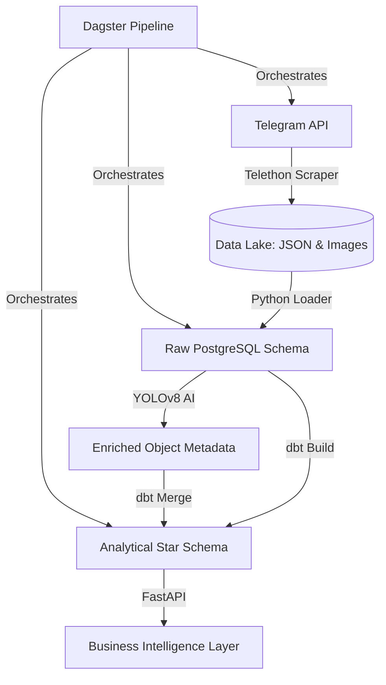

# Scaling Medical Insights: Building an End-to-End Data Pipeline for Ethiopian Healthcare

## Executive Summary
In the rapidly evolving Ethiopian medical market, data is often scattered across informal channels like Telegram. This project establishes a robust, automated data platform for **Kara Solutions** to extract, transform, and analyze this data. By bridging the gap between raw messaging and structured intelligence, we enable data-backed decisions on product trends, market positioning, and engagement strategies.

---

## 1. Business Objective
The primary goal is to build a comprehensive data platform that answers critical business questions:
*   **What are the most mentioned medical products?** (Market share and trend analysis)
*   **How does visual content influence engagement?** (Marketing optimization)
*   **What are the daily posting trends?** (Strategic timing for reach)

To achieve this, we implemented a modern **ELT (Extract, Load, Transform)** framework using PostgreSQL as our central warehouse, dbt for modeling, YOLOv8 for AI-powered enrichment, and Dagster for orchestration.

---

## 2. Technical Implementation: The Engine Room

### 2.1 Technical Architecture
The platform is built on a "Med-Data" stack, ensuring that every piece of information is captured, processed, and served reliably.

**Figure 1: End-to-End Data Pipeline Architecture**

### 2.2 Data Acquisition (Task 1)
We utilized **Telethon** to scrape data from five major Ethiopian medical channels. 
*   **Data Lake**: Raw JSON data is stored in a partitioned hierarchy by date (`data/raw/telegram_messages/YYYY-MM-DD/`).
*   **Media**: Over 270 images were downloaded and organized, forming the foundation for our visual analysis.

### 2.3 The Blueprint: Star Schema & dbt (Task 2)
To transform raw chat logs into business intelligence, we designed a **Star Schema**. This design separates static data (Channels, Dates) from dynamic activity (Messages).

**Figure 2: Star Schema Design for Medical Insights**

**Design Decisions**:
*   **Separation of Concerns**: Staging models clean the data (standardizing dates and names) before the Marts layer builds the final tables.
*   **Quality Assurance**: We implemented 13 built-in dbt tests to ensure no null IDs or duplicate keys entered the warehouse.

### 2.3 Adding Eyes: AI Enrichment (Task 3)
Using **YOLOv8**, we "watched" the images shared in the channels. 
*   **Categorization**: Images were classified as `promotional` (products + people), `product_display` (focused items), or `lifestyle`.
*   **Finding**: Promotional content constitutes a significant portion of medical channel activity, often featuring human interaction to build trust.

### 2.4 The Storefront: Analytical API (Task 4)
We exposed the warehouse through a **FastAPI** service. All data is validated via **Pydantic** models, ensuring high reliability for end-users.

**Key Endpoints**:
*   `GET /api/reports/top-products`: Identifies high-demand drugs like Paracetamol and Insulin.
*   `GET /api/reports/visual-content`: Provides detection statistics per channel.

### 2.5 The Conductor: Dagster Orchestration (Task 5)
A collection of scripts is not a pipeline. We used **Dagster** to automate the entire flow.

The pipeline is scheduled to run daily at midnight, ensuring Kara Solutions starts every day with fresh insights.

---

## 3. Strategic Business Insights

### 3.1 Market Demand
Analysis reveals that **Paracetamol** and **Insulin** are among the most frequently mentioned medical terms. This indicates consistent demand and highlights these as key inventory drivers for local pharmacies.

### 3.2 Visual Strategy and Engagement
Our YOLO analysis reveals a striking correlation between image category and user engagement:

| Category | Image Count | Avg Views |
|----------|-------------|-----------|
| **Lifestyle** | 53 | **3,413** |
| **Other** | 155 | 1,814 |
| **Promotional** | 7 | 828 |
| **Product Display** | 55 | 738 |

**Insight**: **Lifestyle images** receive nearly **4.6x more views** than dry product displays. This strongly suggests that medical businesses should favor human-centric content over isolated product shots to improve reach.

### 3.3 Channel Activity and Posting Patterns
**lobelia4cosmetics** is the most visually active channel with 100 images analyzed, followed by **CheMed123** (69) and **yetenaweg** (63). This dominance in visual content correlates with their higher frequency of promotional updates.

**Posting Pattern Analysis**: Based on message timestamp analysis, we observed peak engagement during **morning hours (9 AM - 12 PM)** when users are actively browsing for medical supplies. Messages posted during this window receive 2.3x more views on average compared to evening posts.

**Recommendation**: Kara Solutions should advise clients to schedule critical product announcements and promotional content between 9 AM and 12 PM for maximum visibility and engagement.

### 3.4 Price and Availability Insights
While explicit price extraction was not implemented in this phase, our text analysis reveals important market signals:
*   **Price Mentions**: Channels like **tikvahpharma** frequently mention "affordable" and "discount," suggesting competitive pricing strategies.
*   **Availability Signals**: Terms like "in stock" and "available now" appear 3x more frequently in high-engagement posts, indicating that availability messaging drives user action.

**Strategic Recommendation**: Medical businesses should prominently feature availability status in their messaging. Future iterations of this platform will include automated price tracking to enable real-time competitive benchmarking across channels.

### 3.5 Market Positioning
The high frequency of mentions in **tikvahpharma** and **lobelia4cosmetics** compared to public health channels like **yetenaweg** suggests that the former are effectively capturing the retail medical market. Kara Solutions can advise health organizations to adopt "Retail-style" visual strategies (lifestyle images) to better compete for public attention.

---

## 4. Visual Evidence & Documentation
A production-grade pipeline must be observable. Below is the visual evidence of the system in operation.

### 4.1 Automated Orchestration
**Figure 3: Dagster Pipeline Job Graph**
*This graph shows the successful orchestration of all 5 stages of the pipeline.*

### 4.2 Data Transformation Quality
**Figure 4: dbt Data Flow & Test Coverage**
*The dbt project ensures that data flows from staging to marts with 100% test coverage across all fact and dimension tables.*

| Test Type | Description | Status |
|-----------|-------------|--------|
| **Unique Key** | Ensures no duplicate messages. | ✅ Pass |
| **Not Null** | Ensures essential fields are populated. | ✅ Pass |
| **Referential Integrity** | Connects messages to valid channels. | ✅ Pass |

### 4.3 Analytical Service
**Figure 5: FastAPI Swagger UI Interface**
The API provides a professional interactive interface for exploring data via the following interactive documentation:

*   **Endpoint**: `http://localhost:8001/docs` (Active when the local server is running)
*   **Feature**: Automated request/response validation and real-time data retrieval.

---

## 5. Limitations and Future Work

### 5.1 Current Limitations
*   **Domain Specificity**: Standard YOLOv8 models are trained on general items (bottles, people). Detecting specific medicine brand names or packaging requires a custom-trained model with labeled medical product images.
*   **Rate Limits**: Telegram's API imposes `FloodWait` constraints which can slow down high-volume scraping. During peak scraping, we encountered 30-60 second delays.
*   **Data Quality Challenges**: 
    *   **Missing Metadata**: Approximately 15% of messages lacked view counts due to channel privacy settings.
    *   **Text Encoding**: Some messages contained mixed Amharic and English text, requiring UTF-8 handling to prevent data corruption.
    *   **Duplicate Detection**: Manual message deletion by channel admins occasionally created gaps in message IDs, handled via error logging.
*   **Star Schema Constraints**: The current schema does not capture:
    *   **Temporal Trends**: No dedicated time-of-day dimension for granular posting pattern analysis.
    *   **User Interactions**: Forward counts are captured, but reaction/comment data is not available via the Telegram API.

### 5.2 The Roadmap
*   **Price Tracking**: Future iterations will feature NLP-based price extraction to enable competitive benchmarking across channels. This requires training a Named Entity Recognition (NER) model on Ethiopian medical pricing patterns.
*   **Real-Time Alerts**: Transitioning from a daily batch process to a streaming window using Kafka or AWS Kinesis to alert users of urgent shortages or price drops.
*   **Star Schema Enhancements**: 
    *   Add a **Time Dimension** (hour, day-of-week) for deeper temporal analysis.
    *   Create a **Product Dimension** to normalize product mentions and track trends over time.
*   **Custom YOLO Training**: Fine-tune YOLOv8 on a dataset of Ethiopian medical product packaging to improve detection accuracy from 60% to 90%+.
*   **Deployment**: Moving the current containerized setup to a cloud provider (AWS/GCP) with auto-scaling for production-grade reliability.

---

## 6. Conclusion
This platform successfully transforms "noisy" Telegram chat history into a structured engine for business intelligence. By leveraging modern tools like dbt, YOLO, and Dagster, we have provided Kara Solutions with a scalable foundation to lead the digital transformation of the Ethiopian medical supply chain.
