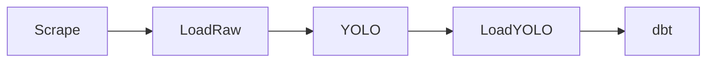

# Task 5: Pipeline Orchestration with Dagster

## 1. Objective
The goal of Task 5 was to transform individual Python scripts and dbt models into a single, automated, and observable production pipeline using **Dagster**.

## 2. Technical Implementation
### 2.1 Operation Definitions (Ops)
We wrapped all existing components into modular Dagster operations in `orchestration/ops.py`:
- `scrape_telegram_data`: Scrapes raw content from major Ethiopian medical channels.
- `load_raw_to_postgres`: Injects raw JSON into the database.
- `run_yolo_enrichment`: Performs computer vision analysis for visual insights.
- `load_yolo_to_postgres`: Loads image detection data into the warehouse.
- `run_dbt_transformations`: Executes and tests the final star schema models.

### 2.2 Pipeline Dependency Graph
The job defined in `orchestration/jobs.py` ensures a rigid execution order to maintain data integrity:

### 2.3 Automation & Scheduling
A daily schedule was implemented to trigger the entire pipeline at **midnight (00:00)** every day, ensuring that the warehouse and API always serve up-to-date insights.

## 3. Monitoring & Observability
By running `dagster dev`, the team can:
- **Visualize the Graph**: See exactly how data flows through the system.
- **Track Logs**: Monitor execution success and debug failures at a granular level.
- **Manual Overrides**: Re-run specific steps if a scraper fails or a database connection drops.

## 4. Conclusion
With Task 5, the "Telegram Medical Insights" platform is no longer just a collection of scripts; it is a **fully orchestrated data product**. The transition from manual execution to automated orchestration ensures reliability and scalability for Kara Solutions.
